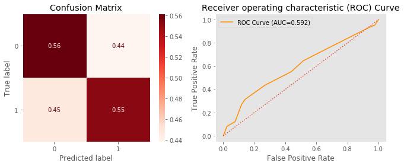
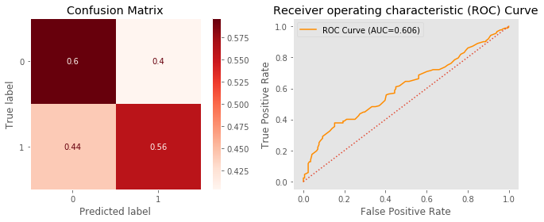
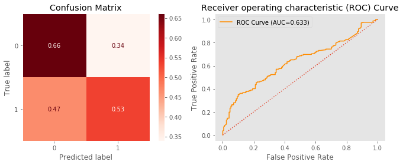
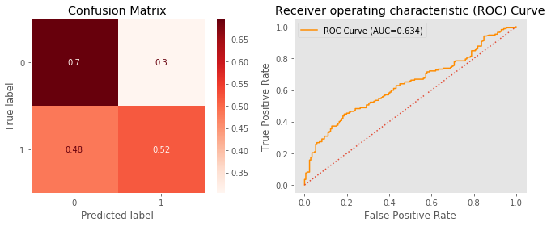
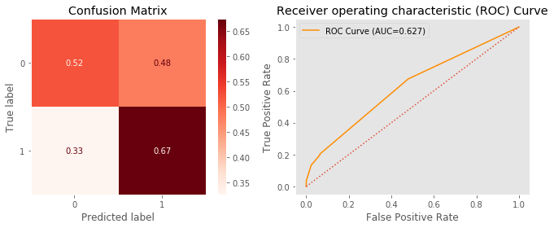
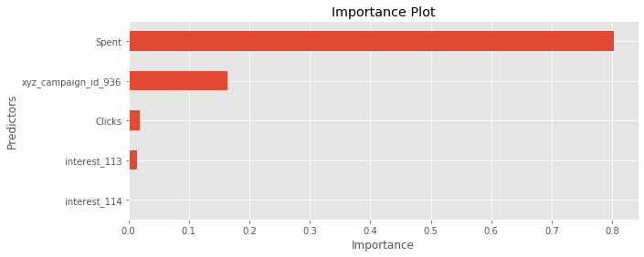

* Student name: Steve Newman
* Student pace: part time 
* Scheduled project review date/time: Tues. May 12 12:30 pm EST
* Instructor name: James Irving PhD
* Blog post URL:https://medium.com/@stevenewmanphotography/classification-blog-e73e72cb8450

# Mod 3 Project Overview

The objective of this project is to leverage classification modelling concepts into an applied real-life scenario in which I have selected my own data set. My data set comes from Kaggle and is titled Sales Conversion Optimization (https://www.kaggle.com/loveall/clicks-conversion-tracking). The target in this data set is labeled Approved Conversion and has values ranging from 0 to 6. For the purposes of model simplification, Approved Conversion was transposed to the binary values of 0 and 1, representing purchased or not.

# Defintions

The data used in this project is from an anonymous organisation’s social media ad campaign.  The file conversion_data.csv contains 1143 observations in 11 variables. Below are the descriptions of the variables.

1.) ad_id: an unique ID for each ad.

2.) xyzcampaignid: an ID associated with each ad campaign of XYZ company.

3.) fbcampaignid: an ID associated with how Facebook tracks each campaign.

4.) age: age of the person to whom the ad is shown.

5.) gender: gender of the person to whim the add is shown

6.) interest: a code specifying the category to which the person’s interest belongs (interests are as mentioned in the person’s Facebook public profile).

7.) Impressions: the number of times the ad was shown.

8.) Clicks: number of clicks on for that ad.

9.) Spent: Amount paid by company xyz to Facebook, to show that ad.

10.) Total conversion: Total number of people who enquired about the product after seeing the ad.

11.) Approved conversion: Total number of people who bought the product after seeing the ad.


```python
from IPython.display import clear_output
!pip install -U fsds_100719
clear_output()
from fsds_100719.imports import *

from sklearn.model_selection import train_test_split

import sklearn.metrics as metrics
import tzlocal
import datetime as dt

from sklearn.tree import DecisionTreeClassifier
from sklearn.model_selection import GridSearchCV
from sklearn.ensemble import RandomForestClassifier
from xgboost import XGBRFClassifier,XGBClassifier

import warnings
warnings.filterwarnings('ignore')

plt.style.use('ggplot')

```

# Explored Data Set


```python
df = pd.read_csv('KAG_conversion_data.csv')
df
```


<div>
<style scoped>
    .dataframe tbody tr th:only-of-type {
        vertical-align: middle;
    }

    .dataframe tbody tr th {
        vertical-align: top;
    }

    .dataframe thead th {
        text-align: right;
    }
</style>
<table border="1" class="dataframe">
  <thead>
    <tr style="text-align: right;">
      <th></th>
      <th>ad_id</th>
      <th>xyz_campaign_id</th>
      <th>fb_campaign_id</th>
      <th>age</th>
      <th>gender</th>
      <th>interest</th>
      <th>Impressions</th>
      <th>Clicks</th>
      <th>Spent</th>
      <th>Total_Conversion</th>
      <th>Approved_Conversion</th>
    </tr>
  </thead>
  <tbody>
    <tr>
      <td>0</td>
      <td>708746</td>
      <td>916</td>
      <td>103916</td>
      <td>30-34</td>
      <td>M</td>
      <td>15</td>
      <td>7350</td>
      <td>1</td>
      <td>1.430000</td>
      <td>2</td>
      <td>1</td>
    </tr>
    <tr>
      <td>1</td>
      <td>708749</td>
      <td>916</td>
      <td>103917</td>
      <td>30-34</td>
      <td>M</td>
      <td>16</td>
      <td>17861</td>
      <td>2</td>
      <td>1.820000</td>
      <td>2</td>
      <td>0</td>
    </tr>
    <tr>
      <td>2</td>
      <td>708771</td>
      <td>916</td>
      <td>103920</td>
      <td>30-34</td>
      <td>M</td>
      <td>20</td>
      <td>693</td>
      <td>0</td>
      <td>0.000000</td>
      <td>1</td>
      <td>0</td>
    </tr>
    <tr>
      <td>3</td>
      <td>708815</td>
      <td>916</td>
      <td>103928</td>
      <td>30-34</td>
      <td>M</td>
      <td>28</td>
      <td>4259</td>
      <td>1</td>
      <td>1.250000</td>
      <td>1</td>
      <td>0</td>
    </tr>
    <tr>
      <td>4</td>
      <td>708818</td>
      <td>916</td>
      <td>103928</td>
      <td>30-34</td>
      <td>M</td>
      <td>28</td>
      <td>4133</td>
      <td>1</td>
      <td>1.290000</td>
      <td>1</td>
      <td>1</td>
    </tr>
    <tr>
      <td>...</td>
      <td>...</td>
      <td>...</td>
      <td>...</td>
      <td>...</td>
      <td>...</td>
      <td>...</td>
      <td>...</td>
      <td>...</td>
      <td>...</td>
      <td>...</td>
      <td>...</td>
    </tr>
    <tr>
      <td>1138</td>
      <td>1314410</td>
      <td>1178</td>
      <td>179977</td>
      <td>45-49</td>
      <td>F</td>
      <td>109</td>
      <td>1129773</td>
      <td>252</td>
      <td>358.189997</td>
      <td>13</td>
      <td>2</td>
    </tr>
    <tr>
      <td>1139</td>
      <td>1314411</td>
      <td>1178</td>
      <td>179978</td>
      <td>45-49</td>
      <td>F</td>
      <td>110</td>
      <td>637549</td>
      <td>120</td>
      <td>173.880003</td>
      <td>3</td>
      <td>0</td>
    </tr>
    <tr>
      <td>1140</td>
      <td>1314412</td>
      <td>1178</td>
      <td>179979</td>
      <td>45-49</td>
      <td>F</td>
      <td>111</td>
      <td>151531</td>
      <td>28</td>
      <td>40.289999</td>
      <td>2</td>
      <td>0</td>
    </tr>
    <tr>
      <td>1141</td>
      <td>1314414</td>
      <td>1178</td>
      <td>179981</td>
      <td>45-49</td>
      <td>F</td>
      <td>113</td>
      <td>790253</td>
      <td>135</td>
      <td>198.710000</td>
      <td>8</td>
      <td>2</td>
    </tr>
    <tr>
      <td>1142</td>
      <td>1314415</td>
      <td>1178</td>
      <td>179982</td>
      <td>45-49</td>
      <td>F</td>
      <td>114</td>
      <td>513161</td>
      <td>114</td>
      <td>165.609999</td>
      <td>5</td>
      <td>2</td>
    </tr>
  </tbody>
</table>
<p>1143 rows × 11 columns</p>
</div>


```python
# No missing values.

df.isna().sum()
```


    ad_id                  0
    xyz_campaign_id        0
    fb_campaign_id         0
    age                    0
    gender                 0
    interest               0
    Impressions            0
    Clicks                 0
    Spent                  0
    Total_Conversion       0
    Approved_Conversion    0
    dtype: int64


```python
# Will need to convert some columns to categories.

df.dtypes
```


    ad_id                    int64
    xyz_campaign_id          int64
    fb_campaign_id           int64
    age                     object
    gender                  object
    interest                 int64
    Impressions              int64
    Clicks                   int64
    Spent                  float64
    Total_Conversion         int64
    Approved_Conversion      int64
    dtype: object


```python
# ad_id needs to be dropped due to number of unique values.

df.nunique()
```


    ad_id                  1143
    xyz_campaign_id           3
    fb_campaign_id          691
    age                       4
    gender                    2
    interest                 40
    Impressions            1130
    Clicks                  183
    Spent                   869
    Total_Conversion         32
    Approved_Conversion      16
    dtype: int64


# Prepare Data for Modeling


```python
#Drop ad_id due to, too many unique values.

df= df.drop(columns=['ad_id'])
```


```python
# Check if 'Approved_Conversion' correlates with the target.
df= df.drop(columns=['Total_Conversion'])
df.corr().loc['Approved_Conversion']
```


    xyz_campaign_id        0.284968
    fb_campaign_id         0.257658
    interest               0.058353
    Impressions            0.684249
    Clicks                 0.559526
    Spent                  0.593178
    Approved_Conversion    1.000000
    Name: Approved_Conversion, dtype: float64


```python
# Convert 'fb_campaign_id' to value count number due to approximately 700 unique values.

campaign_id = dict(df['fb_campaign_id'].value_counts())
df['fb_counts'] = df['fb_campaign_id'].map(campaign_id)
df['fb_counts'].value_counts(dropna=False)
```


    1    463
    2    218
    3    153
    4    148
    5    125
    6     36
    Name: fb_counts, dtype: int64


```python
# Encoding age groups as ordinal

age_ranges = ('30-34','35-39', '40-44','45-49')
age_codes = (0,1,2,3) 
# Zipping into Dictionary to Map onto Column

age_map = dict(zip(age_ranges,age_codes))
age_map
```


    {'30-34': 0, '35-39': 1, '40-44': 2, '45-49': 3}


```python
# Applying age_map to 'age_number' column.

df['age_number'] = df['age'].map(age_map)
df['age_number'].value_counts(dropna=False)
```


    0    426
    3    259
    1    248
    2    210
    Name: age_number, dtype: int64


```python
df
```


<div>
<style scoped>
    .dataframe tbody tr th:only-of-type {
        vertical-align: middle;
    }

    .dataframe tbody tr th {
        vertical-align: top;
    }

    .dataframe thead th {
        text-align: right;
    }
</style>
<table border="1" class="dataframe">
  <thead>
    <tr style="text-align: right;">
      <th></th>
      <th>xyz_campaign_id</th>
      <th>fb_campaign_id</th>
      <th>age</th>
      <th>gender</th>
      <th>interest</th>
      <th>Impressions</th>
      <th>Clicks</th>
      <th>Spent</th>
      <th>Approved_Conversion</th>
      <th>fb_counts</th>
      <th>age_number</th>
    </tr>
  </thead>
  <tbody>
    <tr>
      <td>0</td>
      <td>916</td>
      <td>103916</td>
      <td>30-34</td>
      <td>M</td>
      <td>15</td>
      <td>7350</td>
      <td>1</td>
      <td>1.430000</td>
      <td>1</td>
      <td>1</td>
      <td>0</td>
    </tr>
    <tr>
      <td>1</td>
      <td>916</td>
      <td>103917</td>
      <td>30-34</td>
      <td>M</td>
      <td>16</td>
      <td>17861</td>
      <td>2</td>
      <td>1.820000</td>
      <td>0</td>
      <td>1</td>
      <td>0</td>
    </tr>
    <tr>
      <td>2</td>
      <td>916</td>
      <td>103920</td>
      <td>30-34</td>
      <td>M</td>
      <td>20</td>
      <td>693</td>
      <td>0</td>
      <td>0.000000</td>
      <td>0</td>
      <td>1</td>
      <td>0</td>
    </tr>
    <tr>
      <td>3</td>
      <td>916</td>
      <td>103928</td>
      <td>30-34</td>
      <td>M</td>
      <td>28</td>
      <td>4259</td>
      <td>1</td>
      <td>1.250000</td>
      <td>0</td>
      <td>2</td>
      <td>0</td>
    </tr>
    <tr>
      <td>4</td>
      <td>916</td>
      <td>103928</td>
      <td>30-34</td>
      <td>M</td>
      <td>28</td>
      <td>4133</td>
      <td>1</td>
      <td>1.290000</td>
      <td>1</td>
      <td>2</td>
      <td>0</td>
    </tr>
    <tr>
      <td>...</td>
      <td>...</td>
      <td>...</td>
      <td>...</td>
      <td>...</td>
      <td>...</td>
      <td>...</td>
      <td>...</td>
      <td>...</td>
      <td>...</td>
      <td>...</td>
      <td>...</td>
    </tr>
    <tr>
      <td>1138</td>
      <td>1178</td>
      <td>179977</td>
      <td>45-49</td>
      <td>F</td>
      <td>109</td>
      <td>1129773</td>
      <td>252</td>
      <td>358.189997</td>
      <td>2</td>
      <td>1</td>
      <td>3</td>
    </tr>
    <tr>
      <td>1139</td>
      <td>1178</td>
      <td>179978</td>
      <td>45-49</td>
      <td>F</td>
      <td>110</td>
      <td>637549</td>
      <td>120</td>
      <td>173.880003</td>
      <td>0</td>
      <td>1</td>
      <td>3</td>
    </tr>
    <tr>
      <td>1140</td>
      <td>1178</td>
      <td>179979</td>
      <td>45-49</td>
      <td>F</td>
      <td>111</td>
      <td>151531</td>
      <td>28</td>
      <td>40.289999</td>
      <td>0</td>
      <td>1</td>
      <td>3</td>
    </tr>
    <tr>
      <td>1141</td>
      <td>1178</td>
      <td>179981</td>
      <td>45-49</td>
      <td>F</td>
      <td>113</td>
      <td>790253</td>
      <td>135</td>
      <td>198.710000</td>
      <td>2</td>
      <td>1</td>
      <td>3</td>
    </tr>
    <tr>
      <td>1142</td>
      <td>1178</td>
      <td>179982</td>
      <td>45-49</td>
      <td>F</td>
      <td>114</td>
      <td>513161</td>
      <td>114</td>
      <td>165.609999</td>
      <td>2</td>
      <td>1</td>
      <td>3</td>
    </tr>
  </tbody>
</table>
<p>1143 rows × 11 columns</p>
</div>


```python
# Convert 'Approved_Conversion' from 1 to 6 values to 1 or 0.

df['Approved_Conversion'] = df['Approved_Conversion'].astype('bool').astype('int')
```


```python
df['Approved_Conversion']
```


    0       1
    1       0
    2       0
    3       0
    4       1
           ..
    1138    1
    1139    0
    1140    0
    1141    1
    1142    1
    Name: Approved_Conversion, Length: 1143, dtype: int64


```python
# Convert 'xyz_campaign_id' and 'interest' to category.

to_category = ['xyz_campaign_id','interest']
df[to_category] = df[to_category].astype('category')
```


```python
df.dtypes
```


    xyz_campaign_id        category
    fb_campaign_id            int64
    age                      object
    gender                   object
    interest               category
    Impressions               int64
    Clicks                    int64
    Spent                   float64
    Approved_Conversion       int64
    fb_counts                 int64
    age_number                int64
    dtype: object


```python
# Drop 'fb_campaign_id' and 'age' due to them being transformed into new columns.

df= df.drop(columns=['fb_campaign_id','age'])
```


```python
df
```


<div>
<style scoped>
    .dataframe tbody tr th:only-of-type {
        vertical-align: middle;
    }

    .dataframe tbody tr th {
        vertical-align: top;
    }

    .dataframe thead th {
        text-align: right;
    }
</style>
<table border="1" class="dataframe">
  <thead>
    <tr style="text-align: right;">
      <th></th>
      <th>xyz_campaign_id</th>
      <th>gender</th>
      <th>interest</th>
      <th>Impressions</th>
      <th>Clicks</th>
      <th>Spent</th>
      <th>Approved_Conversion</th>
      <th>fb_counts</th>
      <th>age_number</th>
    </tr>
  </thead>
  <tbody>
    <tr>
      <td>0</td>
      <td>916</td>
      <td>M</td>
      <td>15</td>
      <td>7350</td>
      <td>1</td>
      <td>1.430000</td>
      <td>1</td>
      <td>1</td>
      <td>0</td>
    </tr>
    <tr>
      <td>1</td>
      <td>916</td>
      <td>M</td>
      <td>16</td>
      <td>17861</td>
      <td>2</td>
      <td>1.820000</td>
      <td>0</td>
      <td>1</td>
      <td>0</td>
    </tr>
    <tr>
      <td>2</td>
      <td>916</td>
      <td>M</td>
      <td>20</td>
      <td>693</td>
      <td>0</td>
      <td>0.000000</td>
      <td>0</td>
      <td>1</td>
      <td>0</td>
    </tr>
    <tr>
      <td>3</td>
      <td>916</td>
      <td>M</td>
      <td>28</td>
      <td>4259</td>
      <td>1</td>
      <td>1.250000</td>
      <td>0</td>
      <td>2</td>
      <td>0</td>
    </tr>
    <tr>
      <td>4</td>
      <td>916</td>
      <td>M</td>
      <td>28</td>
      <td>4133</td>
      <td>1</td>
      <td>1.290000</td>
      <td>1</td>
      <td>2</td>
      <td>0</td>
    </tr>
    <tr>
      <td>...</td>
      <td>...</td>
      <td>...</td>
      <td>...</td>
      <td>...</td>
      <td>...</td>
      <td>...</td>
      <td>...</td>
      <td>...</td>
      <td>...</td>
    </tr>
    <tr>
      <td>1138</td>
      <td>1178</td>
      <td>F</td>
      <td>109</td>
      <td>1129773</td>
      <td>252</td>
      <td>358.189997</td>
      <td>1</td>
      <td>1</td>
      <td>3</td>
    </tr>
    <tr>
      <td>1139</td>
      <td>1178</td>
      <td>F</td>
      <td>110</td>
      <td>637549</td>
      <td>120</td>
      <td>173.880003</td>
      <td>0</td>
      <td>1</td>
      <td>3</td>
    </tr>
    <tr>
      <td>1140</td>
      <td>1178</td>
      <td>F</td>
      <td>111</td>
      <td>151531</td>
      <td>28</td>
      <td>40.289999</td>
      <td>0</td>
      <td>1</td>
      <td>3</td>
    </tr>
    <tr>
      <td>1141</td>
      <td>1178</td>
      <td>F</td>
      <td>113</td>
      <td>790253</td>
      <td>135</td>
      <td>198.710000</td>
      <td>1</td>
      <td>1</td>
      <td>3</td>
    </tr>
    <tr>
      <td>1142</td>
      <td>1178</td>
      <td>F</td>
      <td>114</td>
      <td>513161</td>
      <td>114</td>
      <td>165.609999</td>
      <td>1</td>
      <td>1</td>
      <td>3</td>
    </tr>
  </tbody>
</table>
<p>1143 rows × 9 columns</p>
</div>


```python
# One hot encode categorical data.

df = pd.get_dummies(df)
df.head()
```


<div>
<style scoped>
    .dataframe tbody tr th:only-of-type {
        vertical-align: middle;
    }

    .dataframe tbody tr th {
        vertical-align: top;
    }

    .dataframe thead th {
        text-align: right;
    }
</style>
<table border="1" class="dataframe">
  <thead>
    <tr style="text-align: right;">
      <th></th>
      <th>Impressions</th>
      <th>Clicks</th>
      <th>Spent</th>
      <th>Approved_Conversion</th>
      <th>fb_counts</th>
      <th>age_number</th>
      <th>xyz_campaign_id_916</th>
      <th>xyz_campaign_id_936</th>
      <th>xyz_campaign_id_1178</th>
      <th>gender_F</th>
      <th>...</th>
      <th>interest_105</th>
      <th>interest_106</th>
      <th>interest_107</th>
      <th>interest_108</th>
      <th>interest_109</th>
      <th>interest_110</th>
      <th>interest_111</th>
      <th>interest_112</th>
      <th>interest_113</th>
      <th>interest_114</th>
    </tr>
  </thead>
  <tbody>
    <tr>
      <td>0</td>
      <td>7350</td>
      <td>1</td>
      <td>1.43</td>
      <td>1</td>
      <td>1</td>
      <td>0</td>
      <td>1</td>
      <td>0</td>
      <td>0</td>
      <td>0</td>
      <td>...</td>
      <td>0</td>
      <td>0</td>
      <td>0</td>
      <td>0</td>
      <td>0</td>
      <td>0</td>
      <td>0</td>
      <td>0</td>
      <td>0</td>
      <td>0</td>
    </tr>
    <tr>
      <td>1</td>
      <td>17861</td>
      <td>2</td>
      <td>1.82</td>
      <td>0</td>
      <td>1</td>
      <td>0</td>
      <td>1</td>
      <td>0</td>
      <td>0</td>
      <td>0</td>
      <td>...</td>
      <td>0</td>
      <td>0</td>
      <td>0</td>
      <td>0</td>
      <td>0</td>
      <td>0</td>
      <td>0</td>
      <td>0</td>
      <td>0</td>
      <td>0</td>
    </tr>
    <tr>
      <td>2</td>
      <td>693</td>
      <td>0</td>
      <td>0.00</td>
      <td>0</td>
      <td>1</td>
      <td>0</td>
      <td>1</td>
      <td>0</td>
      <td>0</td>
      <td>0</td>
      <td>...</td>
      <td>0</td>
      <td>0</td>
      <td>0</td>
      <td>0</td>
      <td>0</td>
      <td>0</td>
      <td>0</td>
      <td>0</td>
      <td>0</td>
      <td>0</td>
    </tr>
    <tr>
      <td>3</td>
      <td>4259</td>
      <td>1</td>
      <td>1.25</td>
      <td>0</td>
      <td>2</td>
      <td>0</td>
      <td>1</td>
      <td>0</td>
      <td>0</td>
      <td>0</td>
      <td>...</td>
      <td>0</td>
      <td>0</td>
      <td>0</td>
      <td>0</td>
      <td>0</td>
      <td>0</td>
      <td>0</td>
      <td>0</td>
      <td>0</td>
      <td>0</td>
    </tr>
    <tr>
      <td>4</td>
      <td>4133</td>
      <td>1</td>
      <td>1.29</td>
      <td>1</td>
      <td>2</td>
      <td>0</td>
      <td>1</td>
      <td>0</td>
      <td>0</td>
      <td>0</td>
      <td>...</td>
      <td>0</td>
      <td>0</td>
      <td>0</td>
      <td>0</td>
      <td>0</td>
      <td>0</td>
      <td>0</td>
      <td>0</td>
      <td>0</td>
      <td>0</td>
    </tr>
  </tbody>
</table>
<p>5 rows × 51 columns</p>
</div>


```python
# Isolate the target.

y = df.pop('Approved_Conversion')
```


```python
y
```


    0       1
    1       0
    2       0
    3       0
    4       1
           ..
    1138    1
    1139    0
    1140    0
    1141    1
    1142    1
    Name: Approved_Conversion, Length: 1143, dtype: int64


```python
# Train test split

X_train, X_test, y_train,y_test  = train_test_split(df,y,test_size=.3, random_state=123)
```


```python
X_train
```


<div>
<style scoped>
    .dataframe tbody tr th:only-of-type {
        vertical-align: middle;
    }

    .dataframe tbody tr th {
        vertical-align: top;
    }

    .dataframe thead th {
        text-align: right;
    }
</style>
<table border="1" class="dataframe">
  <thead>
    <tr style="text-align: right;">
      <th></th>
      <th>Impressions</th>
      <th>Clicks</th>
      <th>Spent</th>
      <th>fb_counts</th>
      <th>age_number</th>
      <th>xyz_campaign_id_916</th>
      <th>xyz_campaign_id_936</th>
      <th>xyz_campaign_id_1178</th>
      <th>gender_F</th>
      <th>gender_M</th>
      <th>...</th>
      <th>interest_105</th>
      <th>interest_106</th>
      <th>interest_107</th>
      <th>interest_108</th>
      <th>interest_109</th>
      <th>interest_110</th>
      <th>interest_111</th>
      <th>interest_112</th>
      <th>interest_113</th>
      <th>interest_114</th>
    </tr>
  </thead>
  <tbody>
    <tr>
      <td>957</td>
      <td>46391</td>
      <td>11</td>
      <td>16.410000</td>
      <td>3</td>
      <td>2</td>
      <td>0</td>
      <td>0</td>
      <td>1</td>
      <td>1</td>
      <td>0</td>
      <td>...</td>
      <td>0</td>
      <td>0</td>
      <td>0</td>
      <td>0</td>
      <td>0</td>
      <td>0</td>
      <td>0</td>
      <td>0</td>
      <td>0</td>
      <td>0</td>
    </tr>
    <tr>
      <td>1097</td>
      <td>780967</td>
      <td>86</td>
      <td>119.640002</td>
      <td>1</td>
      <td>0</td>
      <td>0</td>
      <td>0</td>
      <td>1</td>
      <td>1</td>
      <td>0</td>
      <td>...</td>
      <td>0</td>
      <td>0</td>
      <td>1</td>
      <td>0</td>
      <td>0</td>
      <td>0</td>
      <td>0</td>
      <td>0</td>
      <td>0</td>
      <td>0</td>
    </tr>
    <tr>
      <td>805</td>
      <td>111963</td>
      <td>17</td>
      <td>29.379999</td>
      <td>6</td>
      <td>3</td>
      <td>0</td>
      <td>0</td>
      <td>1</td>
      <td>0</td>
      <td>1</td>
      <td>...</td>
      <td>0</td>
      <td>0</td>
      <td>0</td>
      <td>0</td>
      <td>0</td>
      <td>0</td>
      <td>0</td>
      <td>0</td>
      <td>0</td>
      <td>0</td>
    </tr>
    <tr>
      <td>298</td>
      <td>11735</td>
      <td>3</td>
      <td>4.530000</td>
      <td>2</td>
      <td>0</td>
      <td>0</td>
      <td>1</td>
      <td>0</td>
      <td>0</td>
      <td>1</td>
      <td>...</td>
      <td>0</td>
      <td>0</td>
      <td>0</td>
      <td>0</td>
      <td>0</td>
      <td>0</td>
      <td>0</td>
      <td>0</td>
      <td>0</td>
      <td>0</td>
    </tr>
    <tr>
      <td>646</td>
      <td>64647</td>
      <td>10</td>
      <td>16.270000</td>
      <td>5</td>
      <td>1</td>
      <td>0</td>
      <td>0</td>
      <td>1</td>
      <td>0</td>
      <td>1</td>
      <td>...</td>
      <td>0</td>
      <td>0</td>
      <td>0</td>
      <td>0</td>
      <td>0</td>
      <td>0</td>
      <td>0</td>
      <td>0</td>
      <td>0</td>
      <td>0</td>
    </tr>
    <tr>
      <td>...</td>
      <td>...</td>
      <td>...</td>
      <td>...</td>
      <td>...</td>
      <td>...</td>
      <td>...</td>
      <td>...</td>
      <td>...</td>
      <td>...</td>
      <td>...</td>
      <td>...</td>
      <td>...</td>
      <td>...</td>
      <td>...</td>
      <td>...</td>
      <td>...</td>
      <td>...</td>
      <td>...</td>
      <td>...</td>
      <td>...</td>
      <td>...</td>
    </tr>
    <tr>
      <td>113</td>
      <td>2522</td>
      <td>0</td>
      <td>0.000000</td>
      <td>1</td>
      <td>0</td>
      <td>0</td>
      <td>1</td>
      <td>0</td>
      <td>0</td>
      <td>1</td>
      <td>...</td>
      <td>0</td>
      <td>0</td>
      <td>0</td>
      <td>0</td>
      <td>0</td>
      <td>0</td>
      <td>0</td>
      <td>0</td>
      <td>0</td>
      <td>0</td>
    </tr>
    <tr>
      <td>96</td>
      <td>1357</td>
      <td>0</td>
      <td>0.000000</td>
      <td>1</td>
      <td>1</td>
      <td>0</td>
      <td>1</td>
      <td>0</td>
      <td>1</td>
      <td>0</td>
      <td>...</td>
      <td>0</td>
      <td>0</td>
      <td>0</td>
      <td>0</td>
      <td>0</td>
      <td>0</td>
      <td>0</td>
      <td>0</td>
      <td>0</td>
      <td>0</td>
    </tr>
    <tr>
      <td>106</td>
      <td>69708</td>
      <td>20</td>
      <td>31.289999</td>
      <td>1</td>
      <td>3</td>
      <td>0</td>
      <td>1</td>
      <td>0</td>
      <td>1</td>
      <td>0</td>
      <td>...</td>
      <td>0</td>
      <td>0</td>
      <td>0</td>
      <td>0</td>
      <td>0</td>
      <td>0</td>
      <td>0</td>
      <td>0</td>
      <td>0</td>
      <td>0</td>
    </tr>
    <tr>
      <td>1041</td>
      <td>1111156</td>
      <td>282</td>
      <td>402.300003</td>
      <td>3</td>
      <td>3</td>
      <td>0</td>
      <td>0</td>
      <td>1</td>
      <td>1</td>
      <td>0</td>
      <td>...</td>
      <td>0</td>
      <td>0</td>
      <td>0</td>
      <td>0</td>
      <td>0</td>
      <td>0</td>
      <td>0</td>
      <td>0</td>
      <td>0</td>
      <td>0</td>
    </tr>
    <tr>
      <td>1122</td>
      <td>877535</td>
      <td>149</td>
      <td>217.779997</td>
      <td>1</td>
      <td>2</td>
      <td>0</td>
      <td>0</td>
      <td>1</td>
      <td>1</td>
      <td>0</td>
      <td>...</td>
      <td>0</td>
      <td>0</td>
      <td>1</td>
      <td>0</td>
      <td>0</td>
      <td>0</td>
      <td>0</td>
      <td>0</td>
      <td>0</td>
      <td>0</td>
    </tr>
  </tbody>
</table>
<p>800 rows × 50 columns</p>
</div>


```python
# Check for imbalance.

y_train.value_counts(normalize=True)
```


    1    0.515
    0    0.485
    Name: Approved_Conversion, dtype: float64


```python
y_test.value_counts(normalize=True)
```


    1    0.501458
    0    0.498542
    Name: Approved_Conversion, dtype: float64


# Run Model Function


```python
def run_model(clf, X_trn, y_trn, X_true):
    
    '''
    Intitializes Timer class, starts Timer, fits model, stops Timer, and returns y_hat_test 
    (predicted values of X_true) and clf (classifier).
    
        Parameters:
            
            clf: classifier or instanciated model
            X_trn: X train from test, train, split
            y_trn: y train from test, train, split
            X_true: X test from test, train, split
            
        Returns:
            
            y_hat_test and clf
            
    '''

    
    timer = Timer()
    timer.start()

    clf.fit(X_trn,y_trn)
    
    y_hat_test = clf.predict(X_true)
    
    timer.stop()
    return y_hat_test, clf
```

# Model Evaluation Function


```python
def evaluate_model(clf, y_trn, y_true, y_pred, X_trn, X_true):
    
    '''
    Calculates and displays the following: Train and Test Score, Classification Report, 
    Confusion Matrix, ROC Curve, and Importance Series.
    
        Parameters:
            
            clf: classifier or instanciated model from run_model function
            y_trn: y train from test, train, split
            y_true: y test from test, train, split
            y_pred: y hat test from run_model fuction
            X_trn: X train from test, train, split
            X_true: X test from test, train, split
    
    '''
    # Calculates and displays train and test scores.
    train_score = clf.score(X_trn,y_trn)
    test_score = clf.score(X_true,y_true)
    print(f"Train score= {train_score}")
    print(f"Test score= {test_score}")
    
    # Displays Classification Report / Scores 
    print(metrics.classification_report(y_true,y_pred))
    
    # Displays Confusion Matrix
    fig, ax = plt.subplots(figsize=(10,4),ncols=2)
    metrics.plot_confusion_matrix(clf,X_true,y_true,cmap="Reds",
                                  normalize='true',ax=ax[0])
    ax[0].set(title='Confusion Matrix')
    ax[0].grid(False)
    y_score = clf.predict_proba(X_true)[:,1]
    
    # Calculates and displays ROC Curve
    fpr,tpr,thresh = metrics.roc_curve(y_true,y_score)
    roc_auc = round(metrics.auc(fpr,tpr),3)
    ax[1].plot(fpr,tpr,color='darkorange',label=f'ROC Curve (AUC={roc_auc})')
    ax[1].plot([0,1],[0,1],ls=':')
    ax[1].legend()
    ax[1].grid()
    ax[1].set(ylabel='True Positive Rate',xlabel='False Positive Rate',title='Receiver operating characteristic (ROC) Curve')
    plt.tight_layout()
    plt.show()

    # Calculates and displays Feature Importances.
    df_import = pd.Series(clf.feature_importances_, index = X_train.columns,name='Importance')
    print(df_import.sort_values(ascending=False).head())
```

# Timer Class/Function


```python
class Timer():
    '''
    Timer class with __init__, get_time, start, and stop function defined within. 
    
    '''
    
    # Initialize Timer class, define format, establish local timezone.
    def __init__(self,format_="%m/%d/%y - %I:%M %p"):
        import tzlocal
        self.tz = tzlocal.get_localzone()
        self.fmt = format_
        
        self.created_at = self.get_time()# get time
        
    # Define get time method
    def get_time(self):
        '''
        Returns current time in local timezone.
        
        '''
        import datetime as dt
        return dt.datetime.now(self.tz)

    # Define start
    def start(self):
        '''
        Runs get_time and displays start time.
        
        '''
        time = self.get_time()
        self.start = time
        print(f"[i] Timer started at{self.start.strftime(self.fmt)}")
        
    # Define stop
    def stop(self):
        '''
        Runs get_time and stores as self.end. Displays end and elapsed time.
        
        '''
        time = self.get_time()
        self.end = time
        print(f"[i] Timer ended at {self.end.strftime(self.fmt)}")
        print(f"- Total time = {self.end-self.start}")

# Test Timer class
timer = Timer()
print(timer.created_at)
timer.start()
timer.stop()
```

    2020-05-12 10:49:23.095343-04:00
    [i] Timer started at05/12/20 - 10:49 AM
    [i] Timer ended at 05/12/20 - 10:49 AM
    - Total time = 0:00:00.000290


# Tree Visualization Function


```python
# Visualize the decision tree
def visualize_tree(tree,feature_names=None,class_names=['0','1'],
                   kws={},save_filename=None,format_='png',save_and_show=False):
    """
    Visualizes a sklearn tree using sklearn.tree.export_graphviz.
    
        Parameters:
            tree: Classifier
            feature_names: (default is None) X Train columns
            class_names: default is a list 0 and 1
            kws: empty dictionary
            save_filename: (default is None) file name
            format: default 'png'
            save_and_show: default False
            
    Returns display of visualization of tree and saved file.
    
    """
    # Import needed packages
    from sklearn.tree import export_graphviz
    from IPython.display import SVG
    import graphviz #import Source
    from IPython.display import display
    
    # Set feature names values
    if feature_names is None:
        feature_names=X_train.columns

    # tree_viz_kws dictionary    
    tree_viz_kws =  dict(out_file=None,rounded=True, rotate=False, filled = True)
    tree_viz_kws.update(kws)

    # tree.export_graphviz(dt) #if you wish to save the output to a dot file instead
    tree_data=export_graphviz(tree,feature_names=feature_names, 
                                   class_names=class_names,**tree_viz_kws)
    graph = graphviz.Source(tree_data,format=format_)
    
    # Save file name
    if save_filename is not None:
        graph.render(save_filename)
        if save_and_show:
            display(graph)
        else:
            print(f'[i] Tree saved as {save_filename}.{format_}')
    else:
        display(graph)
```

# Decision Tree Model


```python
tree = DecisionTreeClassifier(max_depth=5)
```


```python
y_hat_test, clf = run_model(tree, X_train, y_train, X_test)
```

    [i] Timer started at05/12/20 - 10:49 AM
    [i] Timer ended at 05/12/20 - 10:49 AM
    - Total time = 0:00:00.007810


# Decision Tree Results


```python
evaluate_model(clf, y_train, y_test, y_hat_test, X_train, X_test)
```

    Train score= 0.705
    Test score= 0.5568513119533528
                  precision    recall  f1-score   support
    
               0       0.55      0.56      0.56       171
               1       0.56      0.55      0.56       172
    
        accuracy                           0.56       343
       macro avg       0.56      0.56      0.56       343
    weighted avg       0.56      0.56      0.56       343
    





    Impressions    0.651394
    Spent          0.174677
    interest_65    0.051234
    interest_22    0.044315
    interest_10    0.017917
    Name: Importance, dtype: float64


## First Decision Tree model shows mediocre results. The model scored 73% on the training data and 60% on the testing data. While the scores indicate that the model did slightly overfit, it only performed slightly better than 60% on recall. It did a descent job predicting true negative (69%) however it fell short in predicting true positive (54%). The most influenctial predictor by far is Impressions.

# Visualize Tree


```python
visualize_tree(tree,feature_names=X_train.columns,save_filename='Tree')
```

    [i] Tree saved as Tree.png


# Random Forest Model


```python
rf = RandomForestClassifier()
```


```python
y_hat_test, clf = run_model(rf, X_train, y_train, X_test)
```

    [i] Timer started at05/12/20 - 10:50 AM
    [i] Timer ended at 05/12/20 - 10:50 AM
    - Total time = 0:00:00.301701


# Random Forest Results


```python
evaluate_model(clf, y_train, y_test,y_hat_test,X_train, X_test)
```

    Train score= 1.0
    Test score= 0.577259475218659
                  precision    recall  f1-score   support
    
               0       0.57      0.60      0.58       171
               1       0.58      0.56      0.57       172
    
        accuracy                           0.58       343
       macro avg       0.58      0.58      0.58       343
    weighted avg       0.58      0.58      0.58       343
    





    Impressions    0.235492
    Spent          0.167316
    Clicks         0.134165
    age_number     0.060373
    fb_counts      0.059988
    Name: Importance, dtype: float64


## Random Forest overtrained the test data, indicated by a Train Score of 1. The results were surprisingly similar to a plain Decision Tree with exception of the overtrained train data. Clicks did make a showing in the top three pedictors, where it had not in the past.

# RF Grid Search


```python
tree = RandomForestClassifier()

# Set up param grid

param_grid = {'criterion':['gini','entropy'],
             'max_depth':[None, 5, 3, 10],
             'max_features':['auto','sqrt',3,5,10,30,70],
              'min_samples_leaf': [1,2,3]}

grid_clf = GridSearchCV(tree,param_grid)
```


```python
timer = Timer()
timer.start()

grid_clf.fit(X_train, y_train)

timer.stop()

grid_clf.best_params_
```

    [i] Timer started at05/12/20 - 10:51 AM
    [i] Timer ended at 05/12/20 - 10:53 AM
    - Total time = 0:02:33.554725


    {'criterion': 'entropy',
     'max_depth': 3,
     'max_features': 5,
     'min_samples_leaf': 1}


```python
# Create a tree with the gridsearch's best params

best_tree = RandomForestClassifier(**grid_clf.best_params_)
```


```python
# Create a tree with the gridsearch's best params

timer = Timer()
timer.start()

best_tree.fit(X_train,y_train)

timer.stop()
```

    [i] Timer started at05/12/20 - 10:55 AM
    [i] Timer ended at 05/12/20 - 10:55 AM
    - Total time = 0:00:00.219410


# RF Grid Search Results


```python
y_hat_test = best_tree.predict(X_test)

evaluate_model(best_tree, y_train, y_test, y_hat_test,X_train, X_test)
```

    Train score= 0.67625
    Test score= 0.6180758017492711
                  precision    recall  f1-score   support
    
               0       0.60      0.72      0.65       171
               1       0.65      0.52      0.58       172
    
        accuracy                           0.62       343
       macro avg       0.62      0.62      0.61       343
    weighted avg       0.62      0.62      0.61       343
    


    Impressions             0.233040
    Spent                   0.176581
    Clicks                  0.168309
    xyz_campaign_id_1178    0.088645
    fb_counts               0.056416
    Name: Importance, dtype: float64


## Similiar results to D. Tree Grid Search; slight over train of training data. .58 recall.

# XGBOOST Model


```python
xgb_rf = XGBRFClassifier()
```


```python
y_hat_test, clf = run_model(xgb_rf, X_train, y_train, X_test)
```

    [i] Timer started at05/12/20 - 10:56 AM
    [i] Timer ended at 05/12/20 - 10:56 AM
    - Total time = 0:00:00.149420


# XGBOOST Results


```python
evaluate_model(clf,y_train, y_test,y_hat_test,X_train, X_test)
```

    Train score= 0.685
    Test score= 0.597667638483965
                  precision    recall  f1-score   support
    
               0       0.59      0.66      0.62       171
               1       0.61      0.53      0.57       172
    
        accuracy                           0.60       343
       macro avg       0.60      0.60      0.60       343
    weighted avg       0.60      0.60      0.60       343
    





    xyz_campaign_id_1178    0.217722
    Impressions             0.166799
    xyz_campaign_id_936     0.098505
    Spent                   0.090730
    gender_M                0.048028
    Name: Importance, dtype: float32


## Average results; very low true positive results.

# XGBOOST RF Model


```python
xgbrf_grid = {'colsample_bynode': 0.8, 'learning_rate': .1,
              'max_depth': 5, 'num_parallel_tree': 100, 
              'objective': 'binary:logistic', 'subsample': 0.8}

xrf_clf = XGBRFClassifier(**xgbrf_grid)
```


```python
timer = Timer()
timer.start()

xrf_clf = XGBRFClassifier(**xgbrf_grid)
xrf_clf.fit(X_train,y_train)

timer.stop()
grid_clf.best_params_
```

    [i] Timer started at05/12/20 - 10:56 AM
    [i] Timer ended at 05/12/20 - 10:56 AM
    - Total time = 0:00:00.233776


    {'criterion': 'entropy',
     'max_depth': 3,
     'max_features': 5,
     'min_samples_leaf': 1}


# XGBOOST RF Results


```python
y_hat_test = xrf_clf.predict(X_test)

evaluate_model(xrf_clf, y_train, y_test,y_hat_test,X_train, X_test)
```

    Train score= 0.71125
    Test score= 0.6064139941690962
                  precision    recall  f1-score   support
    
               0       0.59      0.70      0.64       171
               1       0.63      0.52      0.57       172
    
        accuracy                           0.61       343
       macro avg       0.61      0.61      0.60       343
    weighted avg       0.61      0.61      0.60       343
    





    Impressions             0.120460
    xyz_campaign_id_1178    0.091145
    Spent                   0.068425
    interest_65             0.061968
    xyz_campaign_id_936     0.055110
    Name: Importance, dtype: float32


## Overtrained training set and very low true positive results.

# Grid Search CV Model


```python
tree = DecisionTreeClassifier()


param_grid = {'criterion':['entropy'],
             'max_depth':[3],
             'max_features':['sqrt'],
              'min_samples_leaf': [3]}

grid_clf = GridSearchCV(tree,param_grid)
```


```python
timer = Timer()
timer.start()

# Fit Grid Search to Decission Tree.

grid_clf.fit(X_train,y_train)

timer.stop()
grid_clf.best_params_
```

    [i] Timer started at05/12/20 - 11:21 AM
    [i] Timer ended at 05/12/20 - 11:21 AM
    - Total time = 0:00:00.044177


    {'criterion': 'entropy',
     'max_depth': 3,
     'max_features': 'sqrt',
     'min_samples_leaf': 3}


```python
# Create a tree with the gridsearch's best params

best_tree = DecisionTreeClassifier(**grid_clf.best_params_)
best_tree.fit(X_train,y_train)
```


    DecisionTreeClassifier(ccp_alpha=0.0, class_weight=None, criterion='entropy',
                           max_depth=3, max_features='sqrt', max_leaf_nodes=None,
                           min_impurity_decrease=0.0, min_impurity_split=None,
                           min_samples_leaf=3, min_samples_split=2,
                           min_weight_fraction_leaf=0.0, presort='deprecated',
                           random_state=None, splitter='best')


# Grid Search CV Results


```python
y_hat_test = best_tree.predict(X_test)

evaluate_model(best_tree, y_train, y_test,y_hat_test,X_train, X_test)
```

    Train score= 0.62375
    Test score= 0.597667638483965
                  precision    recall  f1-score   support
    
               0       0.61      0.52      0.56       171
               1       0.59      0.67      0.63       172
    
        accuracy                           0.60       343
       macro avg       0.60      0.60      0.60       343
    weighted avg       0.60      0.60      0.60       343
    





    Spent                  0.802933
    xyz_campaign_id_936    0.164539
    Clicks                 0.018951
    interest_113           0.013577
    interest_114           0.000000
    Name: Importance, dtype: float64


# Final Results

# For the business problem of identifying which variables contribute to classifying if customers make a purchase; Grid Search CV on a Decision Tree model had the best results of all the models tried. Specifically the variables criterion: entropy; max_depth: 3; max_features: sqrt; min_samples_leaf: 3.


# The training and test score are both mid to low .60's indicating that the model did not over or under fit the training data and had a siliar result on the test data. 

# The recall score of .67 indicates a 17% improvement of identifying true positives from random chance. The top three predictors are Impressions,  xyz_campaign_id_936, and interest_110.


```python
fig, ax = plt.subplots(figsize=(10,4))
df_import = pd.Series(best_tree.feature_importances_, index = X_train.columns,name='Importance')
(df_import.sort_values(ascending=True).tail()).plot(kind = 'barh')
xaxis = 'Importance'
ax.set(ylabel='Predictors',xlabel='Importance',title='Importance Plot');
```





# Recommendations

I recommend to invest a large amount into ads for the best return on investment. Specifically replicate what is done in ad id number 936. For an extra boost, focus on interest number 113.

# Future Work

In the future, I would try to work with a larger data set including both rows of customer behavior and columns of predictors. Additionally, I would like to look at trends across seasonal time periods. Perhaps different marketing strategies will be more affective in different time periods. Lastly, I would research into what exactly the interest codes translate to.


```python

```
